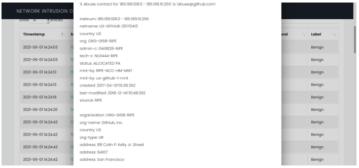

# Real Time Network Intrusion Detection System Using Machine Learning
[Draft Paper](https://drive.google.com/file/d/1nDl880ZMD_wg15fBSch-i1eifrLqw_2e/view?usp=drivesdk)

### Overview 
I worked on a research-based project on Network Intrusion Detection Systems(NIDS) using machine learning. NIDS is a platform that examines network traffic and identifies intrusions. Most of the existing NIDS are signature-based, known intrusion patterns are stored in the database and then compared. Since new intrusion can be generated from minor changes in existing malware. To cope with this problem, a new solution was proposed by using machine learning that can detect even new intrusion. Along with the research, We also develop a real-time NIDS application using python-flask.


### Task Performed
Major tasks performed during the projects are:

1. Studied literature related to IDS and machine learning.
2. Studied IDS datasets.
3. Balancing Data for Multi-class classification SMOTE-TOMEK.
4. Training and Evaluating Machine Learning Models.
5. Comparison with previous related work.
6. Develop prototype integrating trained model in application build with flask.
7. Capturing packets and generating flows from network using CICFLOWMETER.
8. Predicting each flows with model in Real-Time


## Setting Up Linux Dependencies:


### CICFLOWMETER:

CICFLOWMETER has been modified according to our application. NIDS only support
CICFLOWMETER installed from mentioned repository:
```sh
git clone https://github.com/farazahmadkhan15/cicflowmeter-NIDS.git 
cd cicflowmeter-NIDS
sudo python3 setup.py install 
```

### net-tools

```sh
sudo apt install net-tools
```

### whois
```sh
sudo apt install whois
```

### Redis-server
```sh
sudo apt update
sudo apt install redis-server
```

To start Radis Server
```sh
 sudo service redis-server start
```


To check status
```sh
 sudo service redis-server status
```


## Installing Application: 


```sh
git clone https://github.com/farazahmadkhan15/NIDS_APP.git 
cd NIDS_APP 
python3 -m venv venv 
. venv/bin/activate 
 pip install -r requirements.txt 
```

## Running App
```sh
sudo su 
. venv/bin/activate 
flask run
```

## Snaps





